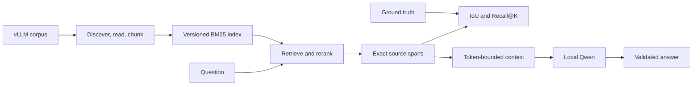

*This project has been created as part of the 42 curriculum by mlagutin.*

# RAG against the machine

## Description

This project is a fully local Retrieval-Augmented Generation (RAG) system for
questions about the vLLM codebase. It reads and chunks the supplied corpus,
builds a deterministic BM25 index, retrieves exact source locations, and can
give that evidence to `Qwen/Qwen3-0.6B` for a grounded answer.

The required workflow is CPU-compatible and uses no external API. Retrieval is
measured independently from generation, persisted artifacts are validated
before reuse, and generated data remains outside Git.

| Capability | Implementation |
| --- | --- |
| Required retrieval | Custom two-field BM25 with bounded reranking |
| Answer generation | Local `Qwen/Qwen3-0.6B` |
| Source traceability | Project-relative paths and exact character ranges |
| Optional semantic search | Pinned CPU MiniLM embeddings |
| Optional hybrid search | Weighted Reciprocal Rank Fusion for Docs |
| Interfaces | Python Fire CLI and optional local FastAPI server |

## Instructions

Requirements: Python 3.10 or later, `uv`, the supplied vLLM corpus, and the
question datasets.

Install the locked environment:

```bash
make install
```

The Makefile keeps large uv, Hugging Face, and virtual-environment files under
`~/goinfre`, which is suitable for 42 campus storage limits.

Prepare only the input directories needed during evaluation:

```bash
scripts/prepare_evaluation_inputs.sh
```

Place evaluator-provided files as follows:

```text
data/
├── raw/
│   └── vllm-*/
└── datasets/
    ├── AnsweredQuestions/
    │   ├── dataset_docs_public.json
    │   └── dataset_code_public.json
    └── UnansweredQuestions/
        ├── dataset_docs_public.json
        └── dataset_code_public.json
```

`data/processed/` and `data/output/` are created by project commands. Datasets,
indexes, model files, reports, and generated answers are ignored by Git.

### Development commands

```bash
make run          # show the CLI
make debug        # run the CLI through pdb
make test         # run pytest
make lint         # assignment lint configuration
make lint-strict  # flake8 and strict mypy
make clean        # remove local Python check caches
```

## Example Usage

Build the required index:

```bash
uv run python -m src index --max_chunk_size 2000
```

Search one question:

```bash
uv run python -m src search "How does prefix caching work?" --k 5
```

Search a complete dataset:

```bash
uv run python -m src search_dataset \
  --dataset_path data/datasets/UnansweredQuestions/dataset_docs_public.json \
  --k 10 \
  --save_directory data/output/search_results/UnansweredQuestions
```

Evaluate persisted results locally:

```bash
uv run python -m src evaluate \
  --student_search_results_path \
    data/output/search_results/UnansweredQuestions/dataset_docs_public.json \
  --dataset_path \
    data/datasets/AnsweredQuestions/dataset_docs_public.json
```

The official moulinette receives the student results first and ground truth
second:

```bash
./moulinette evaluate_student_search_results \
  data/output/search_results/UnansweredQuestions/dataset_docs_public.json \
  data/datasets/AnsweredQuestions/dataset_docs_public.json \
  --k 10 \
  --max_context_length 2000
```

Generate one answer or a complete answer dataset:

```bash
uv run python -m src answer "How does prefix caching work?" --k 5 --device auto

uv run python -m src answer_dataset \
  --student_search_results_path \
    data/output/search_results/UnansweredQuestions/dataset_docs_public.json \
  --save_directory \
    data/output/search_results_and_answer/UnansweredQuestions \
  --device auto
```

Use `--offline` after the model is cached. CPU works on campus machines; CUDA
is selected only when explicitly available.

## System Architecture



The CLI and HTTP API are public adapters. Workflows coordinate independently
tested ingestion, retrieval, evaluation, and generation components. Stored
indexes bind together a schema version, corpus fingerprint, pipeline
fingerprint, and snapshot checksum.

Detailed component and sequence diagrams are in
[`docs/architecture.md`](docs/architecture.md).

## Chunking Strategy

All chunks preserve exact source text, project-relative paths, and half-open
`[start, end)` character ranges. The configured maximum is validated and never
exceeds the assignment limit of 2000 characters.

- **Python:** AST-aware boundaries preserve modules, classes, methods, and
  functions. Oversized structures use safe recursive or line-based fallbacks.
- **Markdown and text:** headings, paragraphs, lists, fenced blocks, and
  bounded overlap preserve prose context.
- **Ranking metadata:** section paths and identifiers are indexed separately;
  synthetic terms never change the evidence text returned to the evaluator.

Unreadable, unsafe, binary, unsupported, or oversized files are rejected by
the discovery boundary. A chunk audit verifies coverage, order, size, and
source-slice equality.

## Retrieval Method

The mandatory retriever is a custom BM25 inverted index. It uses content terms
and lower-weight metadata terms, rare-term IDF, document-length normalization,
and deterministic tie-breaking. A bounded auxiliary-path penalty reduces
irrelevant tests, examples, and generated assets without excluding them.

Search returns at most `k` ranked `Source` objects. Evaluation matches a result
only when its path equals the reference path and source-span IoU is at least
0.05. Results are joined to ground truth by `question_id`; missing, unrelated,
duplicate, or question-text-mismatched records are rejected.

BM25 remains the default because it outperformed semantic-only retrieval on
this corpus, especially for exact code identifiers. Experiments and parameter
choices are recorded in
[`docs/bm25-tuning-log.md`](docs/bm25-tuning-log.md).

## Grounded Answer Generation

Retrieved locations are read from the corpus, deduplicated, labelled as
sources, and added whole while they fit the context token budget. Qwen is
loaded once per process and reused for batch generation. Single-query answers
apply deterministic citation validation; invalid grounding becomes a
controlled error rather than an unverified answer.

The small mandatory model has known reasoning limits. The project guarantees a
traceable evidence path and controlled behavior, not perfect prose.

## Optional Bonuses

All bonuses preserve the required BM25 CLI and run on CPU-only machines:

1. **Semantic embeddings:** MiniLM encodes the same exact chunks into a
   checksum-linked vector index.
2. **Hybrid retrieval:** weighted RRF combines lexical and semantic ranks for
   Docs; Code remains on the stronger BM25 path.
3. **Incremental indexing:** unchanged files reuse trusted lexical documents;
   final BM25 statistics are rebuilt from the current corpus.
4. **Caching:** search and validated-answer caches use complete compatibility
   identities and atomic replacement.
5. **Local HTTP API:** FastAPI reuses one loaded index and lazily loads one
   thread-safe generation backend.

Run the optional API:

```bash
uv run uvicorn 'src.api:create_app' --factory --host 127.0.0.1 --port 8000
```

## Performance Analysis

Measurements below were reproduced on the development Linux machine. Timing
depends on hardware; the assignment limits are the acceptance criteria.

| Measure | Result | Required limit |
| --- | ---: | ---: |
| Full index, 20,096 documents | 29.4 s | at most 300 s |
| Retrieval normalized to 200 questions | 19.51–19.88 s | at most 90 s |
| Docs Recall@5 / Recall@10 | 0.850000 / 0.900000 | Recall@5 >= 0.80 |
| Code Recall@5 / Recall@10 | 0.787879 / 0.848485 | Recall@5 >= 0.50 |
| Incremental reindex, one changed file | 7.1 s | bonus measurement |
| Full automated test suite | 579 passed | all checks pass |

Recall is measured independently for Docs and Code. MRR and Recall@1/3/5/10
are available through `evaluate` and `evaluate_all`; the external moulinette
remains the official evaluator.

## Design Decisions

- **Custom BM25:** exposes tokenization, scoring, persistence, and deterministic
  behavior; experiments cross-checked it against a standard implementation.
- **Exact evidence plus separate metadata:** improves ranking without corrupting
  evaluator-visible source ranges.
- **BM25 as the stable default:** measured better than semantic-only retrieval.
- **RRF instead of raw-score mixing:** BM25 and cosine scores have incompatible
  scales, while rank positions can be combined safely.
- **One generation attempt:** retries did not show reliable quality improvement
  and doubled model cost.
- **Strict compatibility validation:** stale indexes and caches fail clearly
  instead of producing plausible but incorrect results.
- **Thin adapters:** CLI and HTTP translate errors and presentation while domain
  packages own algorithms.

Reconsidered decisions and rejected experiments are recorded in
[`docs/decision-log.md`](docs/decision-log.md).

## Challenges Faced

- Preserving exact UTF-8 offsets while creating useful structural chunks was
  solved with immutable source slices and format-specific chunkers.
- Broad code questions exposed the limits of lexical matching; identifier and
  path signals improved ranking without changing returned evidence.
- Semantic retrieval helped selected Docs questions but reduced aggregate
  performance when applied universally; hybrid retrieval is therefore scoped.
- Small-model generation sometimes omitted or invented citations; deterministic
  validation makes this limitation visible.
- Fine-tuning on 100 curated examples produced no material improvement and was
  removed from production rather than retained as unused complexity.
- Incremental and cached artifacts required explicit identity and integrity
  checks to remain equivalent to clean computation.

## Verification

Current checks:

```text
pytest: 579 passed
flake8: passed
mypy with assignment flags: passed for 239 source files
mypy --strict: passed for 239 source files
git diff --check: passed
```

Expected third-party deprecation warnings currently come from Starlette's
AnyIO compatibility alias and Python Fire's coroutine inspection.

## Resources

- [Python `ast` documentation](https://docs.python.org/3/library/ast.html)
- [Pydantic documentation](https://docs.pydantic.dev/)
- [Python Fire documentation](https://google.github.io/python-fire/)
- [Hugging Face Transformers documentation](https://huggingface.co/docs/transformers/)
- [Qwen3-0.6B model card](https://huggingface.co/Qwen/Qwen3-0.6B)
- [Sentence Transformers documentation](https://www.sbert.net/)
- [FastAPI documentation](https://fastapi.tiangolo.com/)
- [Robertson and Zaragoza, *The Probabilistic Relevance Framework: BM25 and Beyond*](https://www.staff.city.ac.uk/~sbrp622/papers/foundations_bm25_review.pdf)
- [Cormack, Clarke, and Buettcher, *Reciprocal Rank Fusion Outperforms Condorcet and Individual Rank Learning Methods*](https://plg.uwaterloo.ca/~gvcormac/cormacksigir09-rrf.pdf)

### AI Usage

AI assisted with architecture discussion, test-case brainstorming,
documentation editing, and reviewing implementation alternatives. All
production behavior, measurements, source locations, and commands were checked
locally. AI-generated suggestions were accepted only after tests, lint, and
manual review; AI is not used at runtime except for the required local Qwen
generation model.

## License

This project is available under the [MIT License](LICENSE).
