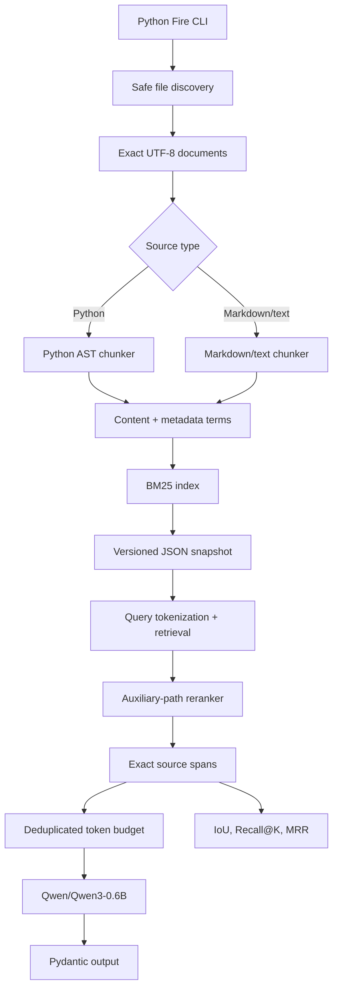
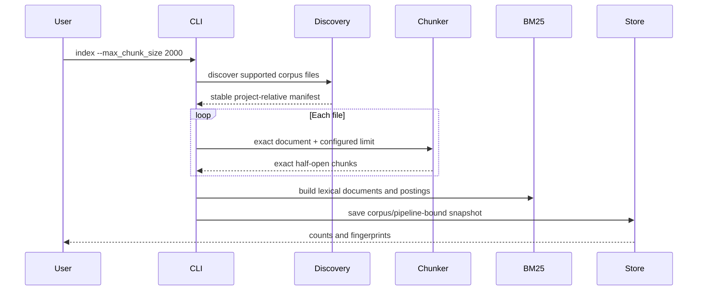
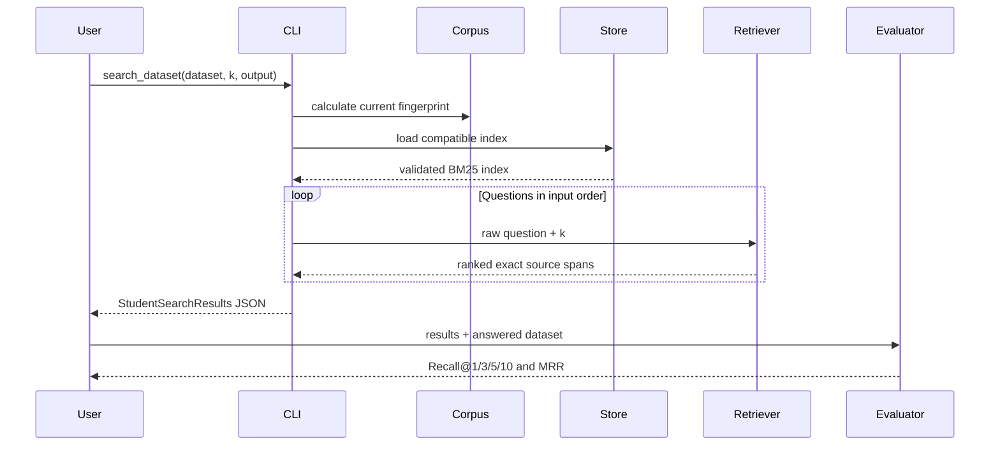
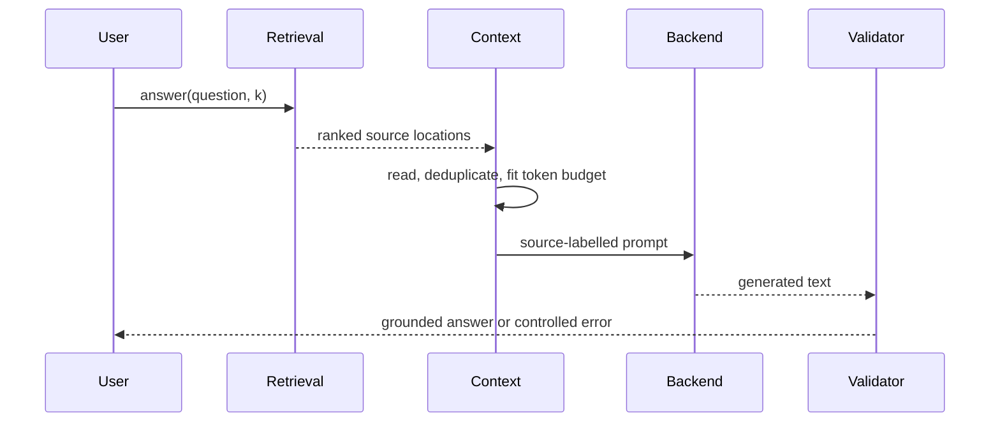
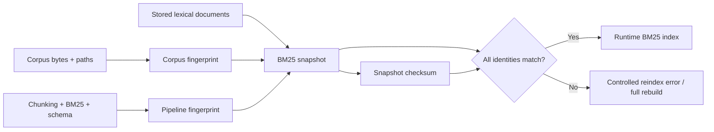
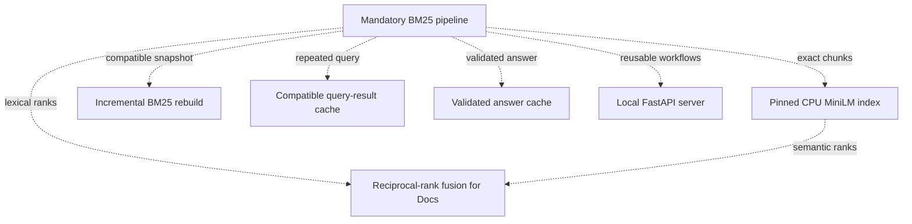

# Architecture Reference

This document is the detailed map behind the compact diagram in the
[README](../README.md#system-architecture). It separates the mandatory RAG
pipeline from optional engineering bonuses so that each flow can be explained
without reading one oversized diagram.

## Architectural boundaries

The project follows four practical boundaries:

1. **Public boundaries** parse user input and convert expected failures into
   stable CLI or HTTP responses.
2. **Workflows** coordinate already-defined domain operations without owning
   tokenization, ranking, persistence, or generation algorithms.
3. **Domain components** implement one responsibility such as chunking, BM25
   scoring, context construction, or prompt validation.
4. **Persistence adapters** validate stored JSON and bind it to the exact
   corpus and pipeline that produced it.

The public CLI is intentionally thin even though all commands are collected in
one module. Domain logic remains independently testable below that boundary.

| Boundary | Main files | Responsibility |
| --- | --- | --- |
| CLI | [`src/__main__.py`](../src/__main__.py), [`src/cli.py`](../src/cli.py) | Python Fire command registry, argument defaults, progress, concise errors |
| HTTP bonus | [`src/api/app.py`](../src/api/app.py), [`src/api/state.py`](../src/api/state.py) | Long-running process with one loaded index and lazy model loading |
| Assignment schemas | [`src/models.py`](../src/models.py) | Pydantic input/output contracts required by the subject |
| Ingestion | [`src/ingestion/`](../src/ingestion/) | Safe discovery, exact reads, source-aware chunking, invariant audits |
| Retrieval | [`src/retrieval/`](../src/retrieval/) | Tokenization, BM25, reranking, persisted results, caches, optional semantic/hybrid paths |
| Generation | [`src/generation/`](../src/generation/) | Context budgeting, prompt construction, local Qwen execution, validation, answer caching |
| Evaluation | [`src/evaluation/`](../src/evaluation/) | Ground-truth joins, IoU, Recall@K, MRR, error analysis, answer diagnostics |

## Mandatory component flow



### Why this shape

- Discovery and reading are separate from chunking, so filesystem safety does
  not depend on a parser.
- Python and text use different chunkers because their structural boundaries
  are different, but both return the same immutable `Chunk` contract.
- Exact source text and coordinates remain evidence; synthetic structural
  terms are stored separately for ranking.
- Retrieval produces assignment-compatible locations before generation begins.
  The evaluator therefore measures retrieval independently of Qwen quality.
- Generation receives a bounded context rather than raw top-k text, keeping
  token budgeting and source traceability deterministic.

## Indexing sequence



Incremental indexing changes only the loop: unchanged files may reuse stored
lexical documents after file, pipeline, schema, and snapshot-integrity checks.
The final index must remain byte-for-byte equivalent to a full rebuild of the
same corpus state.

## Search and evaluation sequence



Evaluation joins by `question_id`, follows ground-truth order, and rejects
missing, unrelated, or duplicate identifiers and question-text mismatches.
This prevents a reordered result file from changing the meaning of a score.

## Answer-generation sequence



The single-query path applies stricter deterministic citation validation than
the assignment requires. The batch path preserves the required output schema
and records model limitations rather than treating perfect phrasing as a
mandatory pass condition.

## Persistence and compatibility



These identities answer different questions:

- the **corpus fingerprint** proves which paths and bytes were indexed;
- the **pipeline fingerprint** proves which chunking and ranking configuration
  produced the index;
- the **schema version** proves that stored fields have known semantics;
- the **snapshot checksum** detects accidental damage to stored evidence.

## Optional bonuses



The bonuses do not silently replace the mandatory route:

- semantic-only search remains optional because it scored below BM25;
- hybrid retrieval is explicitly selected for Docs and leaves Code on BM25;
- caches use complete compatibility keys and can be omitted;
- the HTTP API reuses domain workflows while the required CLI remains intact;
- all bonus behavior is expected to run on CPU-only campus machines.

## Dependency direction

Dependencies point inward toward domain contracts:

```text
CLI / HTTP
    -> workflows
        -> ingestion, retrieval, generation, evaluation components
            -> immutable dataclasses and Pydantic boundary models
```

Domain modules do not import the CLI or HTTP server. Progress callbacks are
passed into workflows, which prevents `tqdm` from becoming a retrieval or
generation dependency. The HTTP API loads shared runtime state in
[`src/api/state.py`](../src/api/state.py) rather than rebuilding resources per
request.

## Intentional duplication versus refactoring

The audit found a few similar helpers and orchestration patterns, but no safe
production refactor that improves the defense version enough to justify its
risk:

- CLI and HTTP both resolve paths below a configured project root, but they are
  independent public boundaries with different error contracts.
- lexical, semantic, and hybrid workflows share a broad shape, but have
  different persisted resources, timing reports, and compatibility checks.
- generation batch and diagnostic commands both load one backend and expose
  progress, but return different domain results.

`src/cli.py` is large because it collects the stable public command surface.
Algorithms and stateful behavior are already split into component packages.
Moving command functions immediately before evaluation would mostly move code
and invalidate patch-based boundary tests without reducing domain complexity.

## Where to start reading

Use this order when reviewing the implementation:

1. [`src/models.py`](../src/models.py) — assignment-facing contracts.
2. [`src/__main__.py`](../src/__main__.py) — complete public command list.
3. [`src/retrieval/index_store/incremental.py`](../src/retrieval/index_store/incremental.py) — indexing orchestration.
4. [`src/ingestion/chunking/orchestrator.py`](../src/ingestion/chunking/orchestrator.py) — format dispatch.
5. [`src/retrieval/bm25/index.py`](../src/retrieval/bm25/index.py) — ranking math and postings.
6. [`src/retrieval/workflow.py`](../src/retrieval/workflow.py) — persisted retrieval flow.
7. [`src/generation/context/workflow.py`](../src/generation/context/workflow.py) — context boundary.
8. [`src/generation/query/workflow.py`](../src/generation/query/workflow.py) — end-to-end answer composition.
9. [`src/evaluation/retrieval/workflow.py`](../src/evaluation/retrieval/workflow.py) — safe evaluation join.
10. [`src/api/app.py`](../src/api/app.py) — optional non-CLI adapter.

For the reasoning behind changes, use the
[decision log](decision-log.md).
